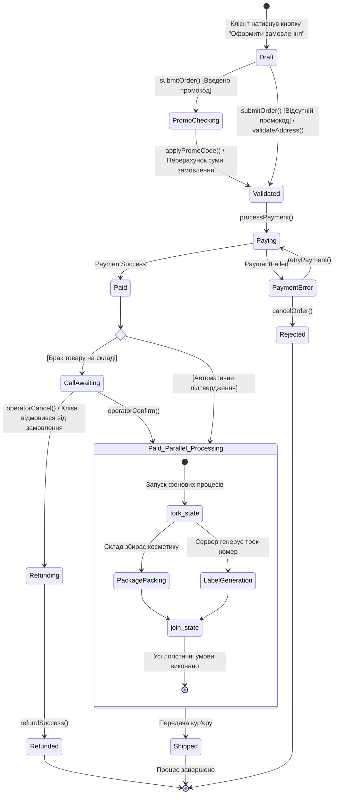

```mermaid
stateDiagram-v2
    [*] --> Draft : Клієнт натиснув кнопку "Оформити замовлення"

    Draft --> PromoChecking : submitOrder() [Введено промокод]
    Draft --> Validated : submitOrder() [Відсутній промокод] / validateAddress()
    
    PromoChecking --> Validated : applyPromoCode() / Перерахунок суми замовлення
    Validated --> Paying : processPayment()

    Paying --> Paid : PaymentSuccess
    Paying --> PaymentError : PaymentFailed

    PaymentError --> Paying : retryPayment()
    PaymentError --> Rejected : cancelOrder()

    state check_call_needed <<choice>>
    Paid --> check_call_needed
    
    check_call_needed --> CallAwaiting : [Брак товару на складі]
    check_call_needed --> Paid_Parallel_Processing : [Автоматичне підтвердження]
    
    CallAwaiting --> Paid_Parallel_Processing : operatorConfirm()
    CallAwaiting --> Refunding : operatorCancel() / Клієнт відмовився від замовлення

    Refunding --> Refunded : refundSuccess()
    Refunded --> [*]

    state Paid_Parallel_Processing {
        [*] --> fork_state : Запуск фонових процесів
        
        fork_state --> PackagePacking : Склад збирає косметику
        fork_state --> LabelGeneration : Сервер генерує трек-номер

        PackagePacking --> join_state
        LabelGeneration --> join_state
        
        join_state --> [*] : Усі логістичні умови виконано
    }

    Paid_Parallel_Processing --> Shipped : Передача кур'єру
    Shipped --> [*] : Процес завершено
    Rejected --> [*]
```
