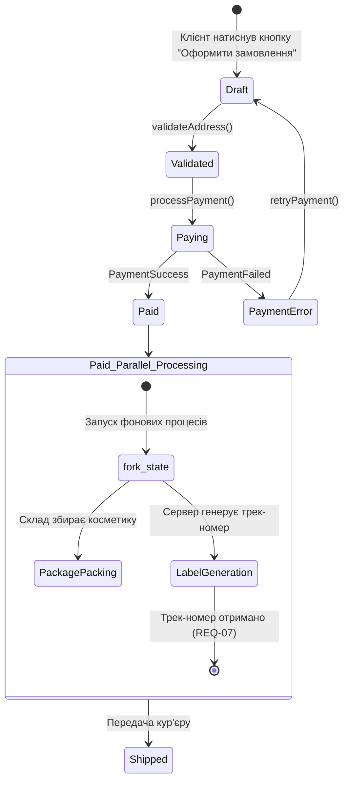

```mermaid
stateDiagram-v2
    [*] --> Draft : Клієнт натиснув кнопку "Оформити замовлення"

    Draft --> Validated : validateAddress()
    Validated --> Paying : processPayment()

    Paying --> Paid : PaymentSuccess
    Paying --> PaymentError : PaymentFailed
    PaymentError --> Draft : retryPayment()

    state Paid_Parallel_Processing {
        [*] --> fork_state : Запуск фонових процесів
        
        fork_state --> PackagePacking : Склад збирає косметику
        fork_state --> LabelGeneration : Сервер генерує трек-номер
        
        LabelGeneration --> [*] : Трек-номер отримано (REQ-07)
    }

    Paid --> Paid_Parallel_Processing
    Paid_Parallel_Processing --> Shipped : Передача кур'єру
```
