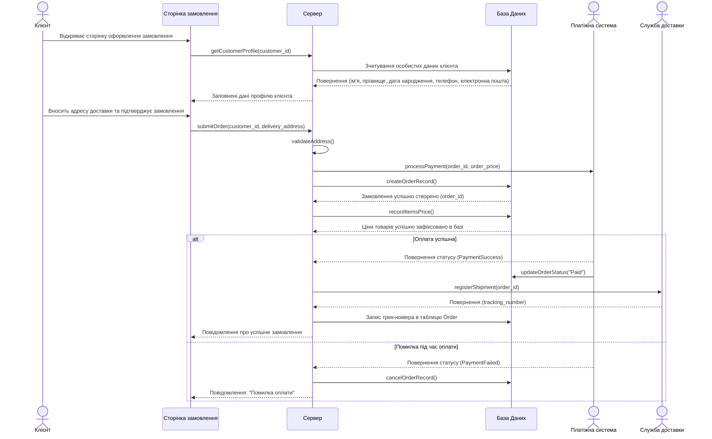

```mermaid
sequenceDiagram
    actor Customer as Клієнт
    participant CheckoutPage as Сторінка замовлення
    participant OrderController as Сервер
    participant Database as База Даних
    actor PaymentService as Платіжна система
    actor DeliveryService as Служба доставки 

    Customer->>CheckoutPage: Відкриває сторінку оформлення замовлення
    CheckoutPage->>OrderController: getCustomerProfile(customer_id)
    OrderController->>Database: Зчитування особистих даних клієнта
    Database-->>OrderController: Повернення (ім'я, прізвище, дата народження, телефон, електронна пошта)
    OrderController-->>CheckoutPage: Заповнені дані профілю клієнта

    Customer->>CheckoutPage: Вносить адресу доставки та підтверджує замовлення
    CheckoutPage->>OrderController: submitOrder(customer_id, delivery_address)
    
    OrderController->>OrderController: validateAddress()
    OrderController->>PaymentService: processPayment(order_id, order_price)
    
    OrderController->>Database: createOrderRecord()
    Database-->>OrderController: Замовлення успішно створено (order_id)
    OrderController->>Database: recordItemsPrice()
    Database-->>OrderController: Ціни товарів успішно зафіксовано в базі

    alt Оплата успішна
        PaymentService-->>OrderController: Повернення статусу (PaymentSuccess)
        PaymentService->>Database: updateOrderStatus("Paid")
        
        OrderController->>DeliveryService: registerShipment(order_id)
        DeliveryService-->>OrderController: Повернення (tracking_number)
        OrderController->>Database: Запис трек-номера в таблицю Order
        OrderController-->>CheckoutPage: Повідомлення про успішне замовлення

    else Помилка під час оплати
        PaymentService-->>OrderController: Повернення статусу (PaymentFailed)
        OrderController->>Database: cancelOrderRecord()
        OrderController-->>CheckoutPage: Повідомлення: "Помилка оплати"
    end
```
