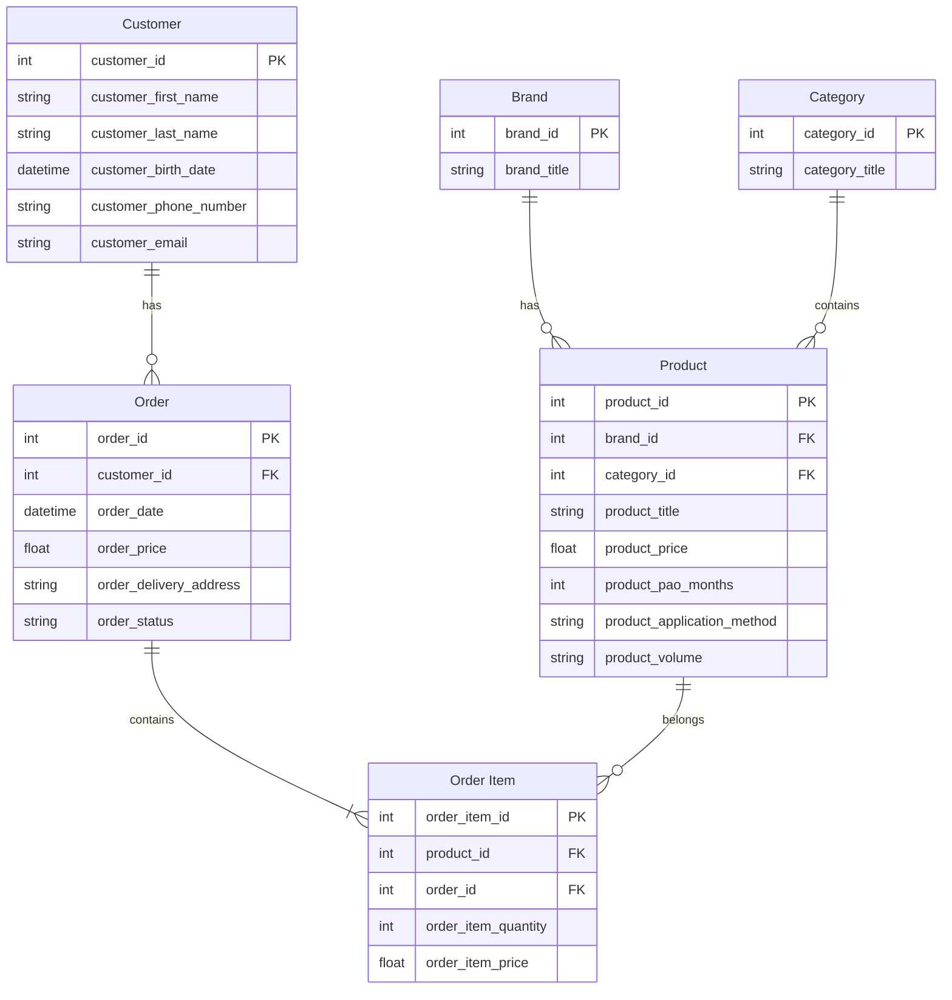

# Специфікація вимог (spec.md)

## 1. Список сутностей та атрибутів
Сутності: Товар, бренд, категорія, клієнт, замовлення, елемент замовлення

Атрибути сутностей:

### Product (товар):
-	product_id – унікальний ідентифікатор товару (primary key)
-	brand_id – бренд до якого належить товар (foreign key)
-	category_id – категорія до якої належить товар (foreign key)
-	product_title – назва продукту
-	product_price – ціна продукту
-	product_pao_months – термін придатності після відкриття у місяцях
-	product_application_method – спосіб застосування
-	product_volume – об’єм продукту
  
### Brand (бренд):
-	brand_id – унікальний ідентифікатор бренду (primary key)
-	brand_title – назва бренду
### Category (категорія):
-	category_id – унікальний ідентифікатор категорії (primary key)
-	category_title – назва категорії
  
### Customer (клієнт):
-	customer_id – унікальний ідентифікатор клієнта (primary key)
-	customer_first_name – ім’я клієнта
-	customer_last_name – прізвище клієнта
-	customer_birth_date – дата народження
-	customer_phone_number – номер телефону
-	customer_email – електронна пошта
  
### Order (замовлення):
-	order_id – унікальний ідентифікатор замовлення (primary key)
-	customer_id – клієнт, який зробив замовлення (foreign key)
-	order_date – дата, коли було оформлене замовлення
-	order_status – статус замовлення
-	order_delivery_address – адреса для доставки
-	order_price – загальна вартість замовлення
  
### Order Item (елемент замовлення): 
-	order_item_id – унікальний ідентифікатор елемента замовлення (primary key)
-	product_id – який це саме продукт (foreign key)
-	order_id – до якого замовлення належить елемент (foreign key)
-	order_item_quantity – кількість продуктів в замовленні
-	order_item_price – ціна на момент оформлення замовлення
  
## 2. Опис зв’язків між сутностями
- Зв’язок між брендом і товаром має тип один до багатьох, оскільки один бренд містить в собі багато продуктів, а один продукт належить до одного конкретного бренду
- Зв’язок між категорією і товаром має тип один до багатьох, оскільки одна категорія вміщує в себе багато продуктів, а один товар належить до однієї конкретної категорії
- Зв’язок між клієнтом і замовленням має тип один до багатьох, оскільки один клієнт може зробити купу замовлень, а одне замовлення належить одному конкретному клієнту
- Оскільки зв’язок між замовленням і товаром має тип багато до багатьох (замовлення може містити кілька товарів і один товар може бути в кількох замовленнях) була додана асоціативна сутність елемент замовлення. 
- Зв’язок між замовленням та елементом замовлення має тип один до багатьох, оскільки замовлення може містити багато елементів, а один елемент замовлення належить одному замовленню
- Зв’язок між товаром та елементом замовлення має тип один до багатьох, оскільки один товар може бути в багатьох елементів замовлень, а один елемент замовлення належить одному конкретному товару
  
## 3. Критерії прийняття
- Обмеження кількості товарів одного виду в замовленні: Система повинна блокувати додавання більше 10 одиниць одного і того самого товару в межах одного замовлення.
- Обмеження загальної кількості товарів в замовленні: При спробі додати 26-й товар у замовлення, система має заблокувати дію та вивести повідомлення про переповнення кошика.
- Обов’язкова авторизація для покупок: Оформлення замовлення дозволяється лише для зареєстрованих користувачів. Клієнти без аккаунту мають автоматично перенаправлятися на сторінку входу в аккаунт чи реєстрації.
- Оформлення замовлення: Запит на те, щоб оформити замовлення відхиляється системою, якщо в кошику користувача немає щонайменше одного товару.
- Обов'язкова адреса: Оформити замовлення неможливо без вказання адреси доставки.
- Фіксація ціни: Навіть якщо ціна товару на сайті змінилася, то в уже оформленому замовленні вона залишається такою, як була на момент оформлення.
  

